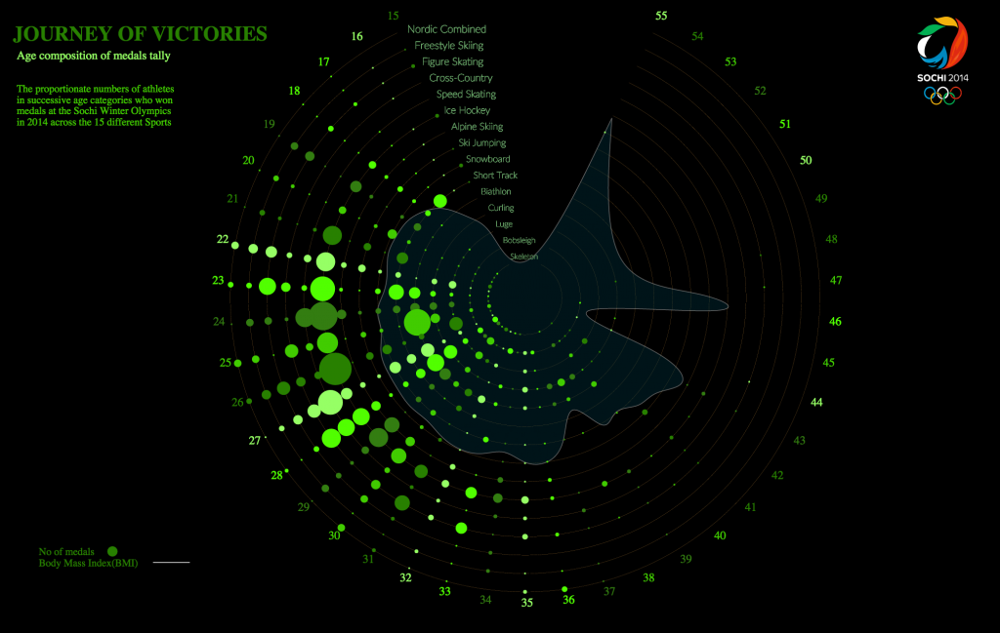
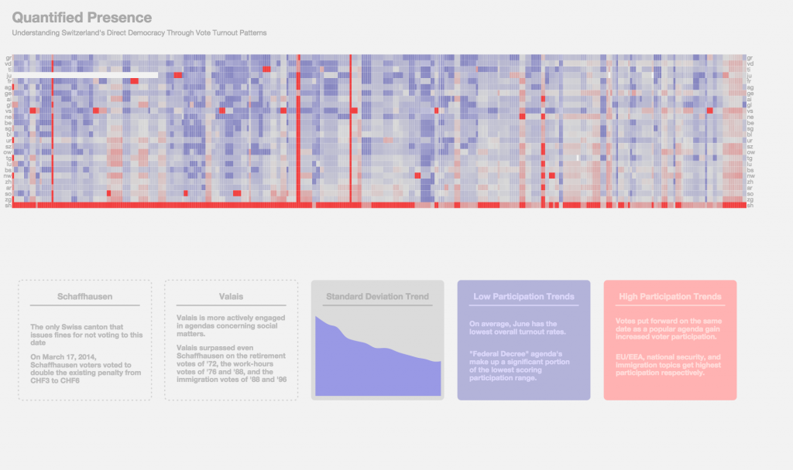

Three projects developed by the students of Master of Advances Studies in Interaction Design will be featured in [Lift Interactive Design Exhibition – Data Canvas: Sense Your City][1].
The exhibition runs on 17th June in Shanghai and on 19th and 21st June in Shenzhen and it presents the results of Sense your city – Data Art Challenge, an initiative promoted by Lift, Swissnex San Francisco and Gray Area to empower citizens to sense and make sense of their environment through the creation of a DIY sensor network to measure pollution, dust, light, sound, temperature, and humidity.

[Data Canvas: Sense your city][2] aimed at creating an interactive map featuring open data and at engaging several communities to use the data to narrate the stories of 7 selected cities. Over the course of four months across three continents, it engaged over 120k people and got to know more than 700 people who participated in workshops and events. 98 citizens assembled and deployed sensors on their residences, offices, universities and local hackerspaces, and 340 people exchanged ideas online.

The selected projects of Maind program’s students are:

## Open Data Installation, Mona Diab, 2014

The installation is composed of three different stations tackling three different aspects of Open Data. A data station that creates a basic awareness of the difference between open and closed data. A visualization station that give citizens a platform to explore those data and see it in a more understandable format. Lastly the information station, in which users get more informed about the importance of Open Data in their everyday lives.

Type: interactive physical prototype  
Technology: Arduino, Processing  



## Journey of Victories, Seena Peethambaran, Sandro Pianetti, 2014

Journey of Victories visualizes the age composition of medals tally during Sochi Winter Olympics in 2014. The project allows users to explore the proportionate numbers of athletes in successive age categories who won medals across the 15 different Sports.

Type: interactive digital prototype  
Technology: d3.js  

## Quantified Presence, Erik Bio, Thoraya Binzagr, Soyeon Hwang, 2015

Quantified Presence is a graphical data visualisation of Swiss voters’ turn-out rates for votes between 1971 and 2014. Though multiple examples visualising data for Switzerland’s voting results already exist, none of them place any specific emphasis on addressing turnout rate patterns in relation to each vote topic. Seeing as citizen participation is an integral part of direct democracy, Switzerland’s official political system, investigating turn-out trends can shed light on a variety of insights relating to the when and the why behind what motivates voters to vote. By visualising turn-out data, Quantified Presence reveals which agendas were of most or least interest to the Swiss populace, allowing the user to uncover patterns as well as anomalies that can lead to further revelations concerning Swiss culture, history, character and politics on both regional and national levels.

Type: interactive digital prototype  
Technology: d3.js  

## Gallery

Visit the [flickr album](https://www.flickr.com/photos/maindinteraction/albums/72157654857220896).

[1]: http://liftconference.com/lift-china-15
[2]: http://datacanvas.org/sense-your-city/