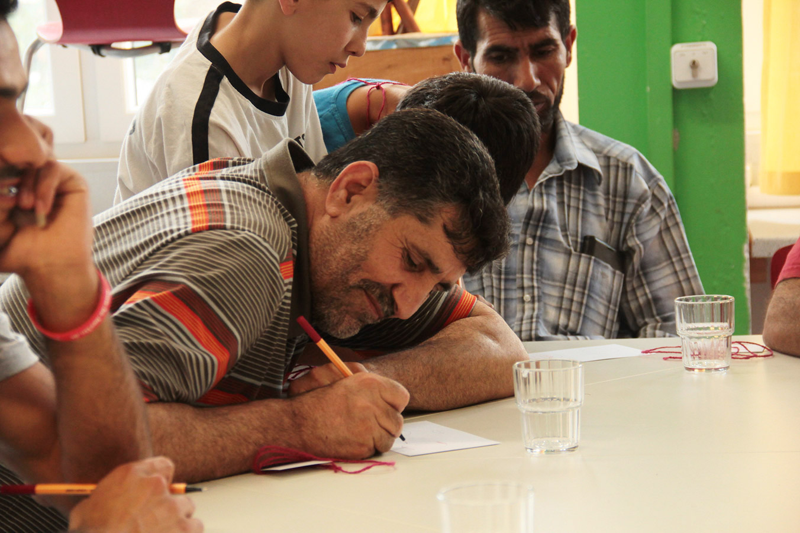

#### A kit that facilitates a cross cultural and personalized integration of refugees. Re:boot is a workshop kit that facilitates progressive refugee integration, through a personalized and easy-to-access information delivery system, that engages them in integration programs.  

In order to ensure continued engagement in integration activities, the refugee community needs to be informed about events and programs that specifically suit their interests and aspirations. Discovering these interests and aspirations was exactly what the Re:boot workshop kit enables: it helps people articulate their aspirations and interests, and based on that, pointing them towards initiatives and organizations that can help them with the same.
The workshop proposes three sessions in which the participants:

* reflect and plan how to realize their integration in the new city

* build individual profiles based on their aspirations and interests, to enable relevant information dispensation

* express themselves freely thanks a gamified approach

* perform non technological driven activities  

The kit is mostly comprised of these picture cards representing various possible aspirations and interests that people may have. One of the reasons behind this being, to enable communication in spite of language barriers. However, in practice, though these picture cards did enable communication as expected, they also triggered further conversations and interactions.

The kit was developed and tested in a workshop organized in November 2016 by [Refugee Academy](http://refugeeacademy.de/en/index.html) in Berlin. It was ideated and designed by Abrar Burk, young interaction designer from India, who developed a research for his master thesis in interaction design at SUPSI.
The project included a larger ecosystem with a data collection device for the digitation of the workshop results, a mobile app for making accessible the integration events, an interaction kiosk to make the events accessible to non-smartphone owners.

[Re:boot Website](http://rebootberlin.com/)  
[Workshop Kit Download](https://drive.google.com/uc?export=download&id=0B9yBnDDSxqaGVGptc2h5ZHEzMTA)  

  

{:class=""}

## Interview to Abrar Burk

#### 1. Why it happened that you started the reboot project?   

Well, over the course of the Masters studies at SUPSI, I was beginning to develop an interest in the broad topic of cities, in terms of their design and planning, place making, mobility etc. How do cities inculcate a sense of tolerance amongst all the different cultural groups that usually live in a city. Is it a harmonious co-existence, or do people tend to live within their parochial domains? So being intrigued by topics like these, I decided to do my thesis project in a similar space. One thing led to another — Berlin — Refugee Community — Integration — felt like an appropriate area to research into, considering my interests, and the idea was to hopefully build a project that can actually have some positive impact.

#### 2. How did you get to the definition of the problem and the solution?   

Before arriving in Berlin, I had no idea about the lives of the refugees there, their living conditions, what the city is doing to make their integration possible etc. I found a couple of NGOs on Facebook, looked for their upcoming integration events / activities and just started attending them, with no real agenda. It was amazing how a couple of these initial language tandems, yoga activities or other programs exposed me to the innumerable organisations who are conducting a wide range of activities such as cooking meetups, arts and crafts, sports, education, legal help, housing support, all with the intention of simplifying and enriching the lives of the newly arrived. But what became very apparent through my observations, and conversations with NGO volunteers and refugee individuals was that the actual attendance and involvement of people from the refugee community at these activities  and programs was almost always minimal.  
 
Why was that? Do these folks not know about these activities that are happening for them, and all around them? Or could it be that they know, but are just not interested / intimidated / wary of this drastically different culture that they find themselves in? Could it be the language barriers? Or could it be that the sheer vastness of the number of different programs that are running in Berlin, is leading to a kind of information pollution, making it difficult for the newly arrived to find and get involved in something that they are specifically looking for or what truly interests them? Further research, conversations, observations led me to believe that the problem, in some part, was all of what I have mentioned above. From this point on, my project essentially became about making relevant information accessible to the people that need it, through a channel that is acceptable and understandable. In a sense, the aim was to personalize integration, which is why I felt that this 'channel' had to be personal human contact. Information needed to be delivered through another human being, and not through an inanimate cellphone screen, or a poster. And eventually, these intentions led to the creation of the re:boot workshop toolkit.
 

#### 3. What do you highlight of the workshop experience in Berlin? (difficulties/surprises)   

Very briefly put, the workshop was about helping people articulate their aspirations and interests, and based on that, pointing them towards initiatives and organizations that can help them with the same. I had conducted the workshop for an Arabic speaking group, mostly from Syria and Iraq. An Arabic translator was helping me throughout the facilitation of the workshop, because without him, it would have been impossible to communicate why we are doing what we are doing, or even build a sense of trust amongst them.  
 
The kit is mostly comprised of these picture cards representing various possible aspirations and interests that people may have. One of the reasons behind this being, to enable communication in spite of language barriers. However, in practice, though these picture cards did enable communication as expected, they also triggered further conversations and interactions. This workshop I realized was acting as a catalyst, getting people to talk and express extensively, but I mostly found myself lost during these conversations, due to the language gap, and the confusion of so many such conversations happening at once. It made me realize that in the future, I need to somehow take a step back from facilitation, and instead introduce this methodology to arabic / farsi (any other language for that matter) speaking volunteers and have them conduct these workshops for best results.  
 
Another unexpected occurrence during the workshop was, the attendance of trouble makers, with the sole intention of disrupting the activities and influencing other participants in a negative way. How does one deal with situations like these, and maintain a positive, productive environment, was also an unexpected learning that came out of the workshop.
 
#### 4. What is the main impact of your kit?   

As mentioned above, I feel like the kit enables conversations. Extensive conversations. This I felt was a major impact since, getting people to open up and articulate what’s going on inside their heads is never an easy task. Not to say that this kit has solved this problem a 100 percent, but it definitely makes this aspect of breaking the ice, and understanding peoples' hopes and aspirations a lot easier.  
 
Secondly, restricting the use of this toolkit solely to the workshop setup is unnecessary. Besides, the concept of workshops is widely understood and practiced in western countries, which may not be true in many other parts of the world. This definitely causes a section of our target groups to shy away from them. On the other hand, everyday, volunteers are visiting refugee shelters, interacting with people, trying to dig deeper and help people on an individual level. I feel this toolkit could be very useful in that context as well. I would be very curious to see how this kit would be improvised and adapted in different contexts such as these, and in the end, turn into a much more sustainable product. Which is why I have distributed the kit amongst a few volunteers that I know in Berlin, with the hope that each of them use and improvise the kit as it suits them best. For the same reason, the digital files of the kit are available for download on the reboot website.
 
#### 5. What do you think it is the impact of your work as interaction designer in the context of digital social innovation?   

At the start of this project, I was reading Ezio Manzini's Design, When Everybody Designs, and one of the key pieces of advice that stuck out for me was that, in this social innovation landscape, the role of a designer should be more of a facilitator, enabling the target groups to innovate and develop solutions for themselves. So I feel that, as interaction designers, our job is to identify (in some cases help others identify) and articulate the core of a problem in any given situation and then foster an environment, that empowers all the actors to innovate, improvise, and ultimately hit a solution that is impactful and sustainable. The 'digital' aspect for me is the key to scalability. With open source technology and community, innovation can happen simultaneously all over the world, rather than as separate entities in different pockets of the world. And I think this is also the interaction designers job, to explore, educate and help integrate tech into social innovation projects, if and when required of course.